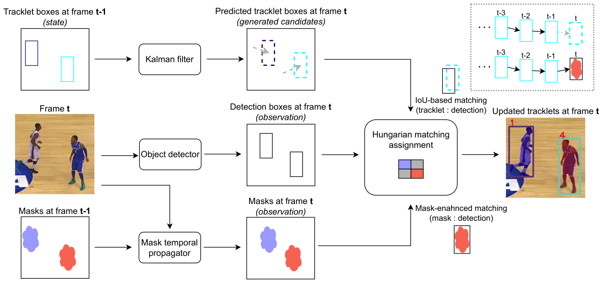

# [CVPRW 2025] McByte official implementation code.

## <i>Please note: This is the release of the first, academic version of McByte, with a <ins>runnable demo included</ins>. More optimized and engineered version is coming soon. Stay tuned!</i> ##
<br/>

>**[No Train Yet Gain: Towards Generic Multi-Object Tracking in Sports and Beyond](https://openaccess.thecvf.com/content/CVPR2025W/CVSPORTS/html/Stanczyk_No_Train_Yet_Gain_Towards_Generic_Multi-Object_Tracking_in_Sports_CVPRW_2025_paper.html)**
>
><ins>Tomasz Stanczyk</ins>, Seongro Yoon, Francois Bremond
>
>[*arxiv 2506.01373*](https://arxiv.org/abs/2506.01373)


## Abstract
Multi-object tracking (MOT) is essential for sports analytics, enabling performance evaluation and tactical insights. However, tracking in sports is challenging due to fast movements, occlusions, and camera shifts. Traditional tracking-by-detection methods require extensive tuning, while segmentation-based approaches struggle with track processing. We propose McByte, a tracking-by-detection framework that integrates temporally propagated segmentation mask as an association cue to improve robustness without per-video tuning. Unlike many existing methods, McByte does not require training, relying solely on pre-trained models and object detectors commonly used in the community. Evaluated on SportsMOT, DanceTrack, SoccerNet-tracking 2022 and MOT17, McByte demonstrates strong performance across sports and general pedestrian tracking. Our results highlight the benefits of mask propagation for a more adaptable and generalizable MOT approach.

<p align="center">
  
</p>

## Added gradually

- [x] Cleaning of the code
- [x] Public release of the first, academic version
- [x] Installation and setting instructions
- [x] 🔥 Directly usable demo 🔥
- [x] Video input file processing
- [x] Using custom/oracle detections
- [ ] Numerical evaluation instructions
- [ ] More optimized and engineered version


## Installation and models

Please follow the complete guideline in [INSTALLATION.md](https://github.com/tstanczyk95/McByte/blob/main/INSTALLATION.md).
<br/>

## 🔥 Demo 🔥

### Simply run the command - no training required:
```
python tools/demo_track.py --path path/to/your/input
```
Input is a frame folder or a video file.<br/>
Output will be located in: <i>McByte/YOLOX_outputs/yolox_x_mix_det/track_vis/date_time_stamp</i>. Folder with processed frames and a log file (see the section below) will be created. Text output file (tracking records per frame in MOT format) will be created outside the folder.

**More arguments:**
- <i>--demo</i> - demo type, input time. Recognized values: <i>image</i> (frames), <i>video</i>. Default: <i>image</i>.
- <i>--vis_type</i> - visualization type, it enables saving separately: frames with masks and tracklets, frames with detections and frames with tracklets before Kalman filter update. Skipping the visualization, while keeing the text (records) output is also possible. Recognized values: <i>full</i> (frame/image input only), <i>basic</i>, <i>no_vis</i>. Default: <i>basic</i>.
- <i>--start_frame_no</i> - number of the first starting frame (assuming that your frames are ordered). E.g., if you want to start tracking from the middle of the sequence rather than from the beginning. Default: 1.
- <i>-f</i> | <i>--exp_file</i> - the name of the YOLOX detector experiment (architecture and parameters) file. Although several ones are possible, we recommend staying with the default: <i>exps/example/mot/yolox_x_mix_det.py</i>. 
- <i>-c</i> | <i>--ckpt</i> - the name of the object detector pretrained weights file (the checkpoint). It must match the architecture from the experiment file above (e.g. YOLOX X). Default: <i>pretrained/yolox_x_sports_mix.pth.tar</i>.
- <i>--det_path</i> - path to the text file with detections. Default: None. If specified, detector-related arguments will not be considered.

**Additional note**: The YOLOX object detector model pretrained on [SportsMOT](https://github.com/MCG-NJU/SportsMOT) as provided by the dataset authors (used as default setting above) behaves very well on the considered sport settings - soccer, basketball, volleyball 🔥

For a complete list of arguments, run:
```
python tools/demo_track.py --help
```

## Logging funcionality 🔍👀
During the run, a logging file will be created and located in: <i>McByte/YOLOX_outputs/yolox_x_mix_det/track_vis/date_time_stamp/logging_info.txt</i>.<br/>
This file contains information per frame with all the tracklets, detections, their confidence scores, tracklet states, associations and cost matrix per step, before and after the mask update. Together with the detection per frame output and traklets-before-Kalman-filter output (<i>--vis_type=full</i>, default, see above), it is a powerful tool to go deep into the details, verify fine-grained behaviour of the tracker and associations per frame, and to further adjust the algorithm to your needs if needed (e.g. if you want to change yourself some hyper-parameters, etc.). This functionality as a whole was very useful in developing McByte and thus we hope it will serve the interested users as well. 
<br/>


## Mask resolution and memory
In case you face issues with memory (e.g. GPU limitations), you can reduce the mask internal representation size of the mask temporal propagator component. <br/><br/>
In order to do that, go to the file: <i>McByte/Cutie/cutie/config/eval_config.yaml</i>. Find the parameter <i>max_internal_size</i> (line 23). By default it is set as -1 which means that the mask internal representation (used to compute the final propagation mask) will have the same dimensions as your input frames/video. You can decrease the size, by updating the -1 with some fraction of the lower size of your input. E.g. If your input has dimensions of 1920x1080, you can try with 540 (50% of 1080), which will reduce the total size by the factor of 4 (2x smaller weight, 2x smaller width). Consider also less natural numbers, e.g. sqrt(2) ~ 1.41, thus in this case, setting the number as 1080/1.41 ~ 766 (total size reduced by the factor of 2).<br/><br/>
Note that as the internal representation of mask becomes smaller, the mask accuracy might decrease. Although mask is used as an association cue in McByte, and small inaccuracies are handled withing the tracker design, significant size changes might lead to overall decreased performace, particularly with small objects and crowds.
<br/>

## Acknowledgement
A large part of the McByte code was borrwed from [ByteTrack](https://github.com/FoundationVision/ByteTrack), [YOLOX](https://github.com/Megvii-BaseDetection/YOLOX) and [Cutie](https://github.com/hkchengrex/Cutie). [SAM](https://github.com/facebookresearch/segment-anything) model was smoothly incorporated and some additional parts were borrowed from [BoT-SORT](https://github.com/NirAharon/BoT-SORT). Many thanks to all the authors for their amazing work! 


## Usage and citation

If you find this work useful, consider leaving us a star ⭐ and please cite it in your research paper as follows: 

```
@InProceedings{Stanczyk_2025_CVPR,
    author    = {Stanczyk, Tomasz and Yoon, Seongro and Bremond, Francois},
    title     = {No Train Yet Gain: Towards Generic Multi-Object Tracking in Sports and Beyond},
    booktitle = {Proceedings of the Computer Vision and Pattern Recognition Conference (CVPR) Workshops},
    month     = {June},
    year      = {2025},
    pages     = {6039-6048}
}
```
